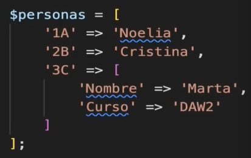
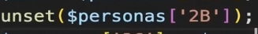

# Sintaxis Básica de PHP

## Conceptos básicos

### Apertura de bloques de codigo

En PHP hay que empezar los documentos `.php` con la etiqueta `<?php` la cual no requiere cerrarse.

### Variables

No hay tipado y las variables se definen con `$`. Por ejemplo `$variable`.

### Arrays

Se usa `[]` entonces para crearlo `$miArray = []` y para añadir cosas al final del:
array `$miArray[] = 'loquesea'`.

Son similares a los objetos de JS.

Se puede meter clave valor con:

Borrar elementos con:

