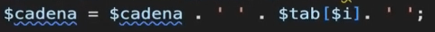

# Sintaxis Básica de PHP

## Conceptos básicos

### Apertura de bloques de codigo

En PHP hay que empezar los documentos `.php` con la etiqueta `<?php` la cual no requiere cerrarse.

### Variables

No hay tipado y las variables se definen con `$`. Por ejemplo `$variable`.

### Arrays

Se usa `[]` entonces para crearlo `$miArray = []` y para añadir cosas al final del:
array `$miArray[] = 'loquesea'`.

Son similares a los objetos de JS.

Se puede meter clave valor con:

Borrar elementos con:

### Strings

Se concatena con el punto:

## Creando nuestro primer servidor

### Manejo de la URL

Sacar datos del server:

Su resultado es:

Entonces de ahí podemos sacar la url y el metodo HTTP de la solicitud:
Por ejemplo de esta forma podemos mostrar esos datos en el navegador:

Para encaminar esto a la creación de unos endpoints debemos poder manejar estos datos:

La función `explode("separador", STRING)` recibe un string del que según un separador crea un vector con los elementos separados por el separador.

Tenemos todos los parámetros de la url, ahora hay que filtrarlos para ejecutar el codigo que corresponda:

Esto es la forma mas simple de endpoint en php.
